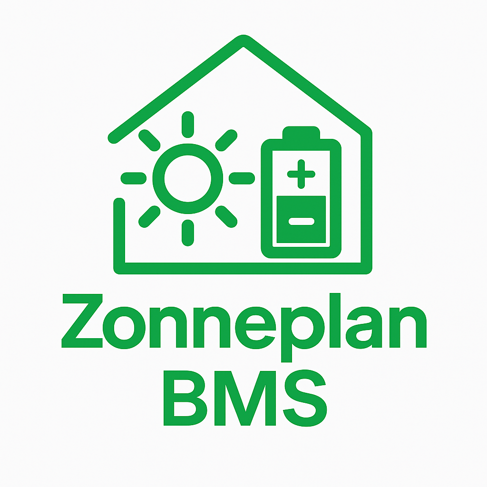

  

Repository based on: https://github.com/fsaris/home-assistant-zonneplan-one

# Zonneplan Peak Detect

This Home Assistant custom component detects the highest and lowest price hours from Zonneplan hourly pricing data.

## Features
- Creates two sensors:
  - `sensor.zonneplan_peak_hour`: index (0-23) of highest price
  - `sensor.zonneplan_valley_hour`: index (0-23) of lowest price

## Requirements
You must have an entity like `sensor.zonneplan_energy_prices` that includes an attribute `today` with a list of 24 hourly prices.

## Installation

1. Copy this repository into `custom_components/zonneplan_peakdetect`
2. Add it via HACS as a custom repository (category: Integration)
3. Restart Home Assistant

## License
MIT
